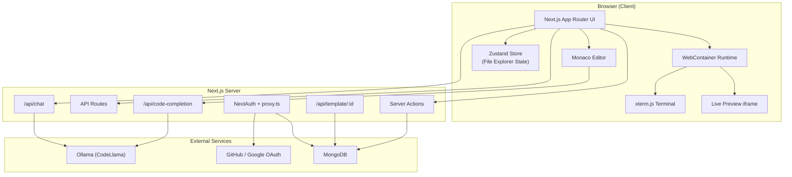

# Sprint AI — AI-Powered Web IDE

> **Vibe Code With Intelligence** — A full-stack, browser-based integrated development environment that combines Monaco Editor, in-browser Node.js runtimes, and local LLM-powered AI assistance to deliver a modern coding experience without leaving the browser.

[](https://nextjs.org/)
[](https://react.dev/)
[](https://www.typescriptlang.org/)
[](https://www.prisma.io/)
[](https://webcontainers.io/)

---

## Table of Contents

- [Overview](#overview)
- [Why This Project Matters](#why-this-project-matters)
- [Key Features](#key-features)
- [Architecture](#architecture)
- [Tech Stack](#tech-stack)
- [Project Structure](#project-structure)
- [Getting Started](#getting-started)
- [Environment Variables](#environment-variables)
- [AI Integration](#ai-integration)
- [Supported Templates](#supported-templates)
- [Technical Highlights](#technical-highlights)
- [Roadmap](#roadmap)
- [About the Developer](#about-the-developer)
- [License](#license)

---

## Overview

**Sprint AI** (also branded as *VibeCode Editor*) is a production-grade web IDE built from scratch. It lets developers create projects from starter templates, edit code in a Monaco-powered editor, run `npm install` and dev servers entirely in the browser via WebContainers, preview live applications in a split pane, and get AI-assisted code completions and chat — all persisted to a MongoDB database with OAuth authentication.

This is not a tutorial clone. It is a **modular, full-stack application** with real auth flows, database persistence, server actions, API routes, complex client-side state management, and deep integration with browser-native runtimes.

---

## Why This Project Matters

Recruiters and hiring managers often look for evidence that a candidate can **ship end-to-end products**, not just isolated components. This project demonstrates:

| Skill Area | What You Can Evaluate |
|---|---|
| **Full-Stack Engineering** | Next.js App Router, Server Actions, API Routes, Prisma ORM, MongoDB |
| **Frontend Architecture** | Modular feature-based structure, Zustand state, custom hooks, resizable layouts |
| **Systems Design** | Dual persistence (DB + in-browser FS sync), template bootstrapping pipeline, auth middleware |
| **Developer Experience** | Monaco Editor integration, inline AI completions, keyboard shortcuts, dark/light themes |
| **Modern Tooling** | WebContainers, xterm.js, Ollama LLM integration, OAuth 2.0 |
| **Product Thinking** | Dashboard UX, project CRUD, template selection, starred projects, empty states |

---

## Key Features

### IDE & Editor
- **Monaco Editor** with syntax highlighting per file extension, tabbed multi-file editing, and unsaved-change tracking
- **Resizable split view** — editor on the left, live preview on the right
- **File explorer** with full CRUD: create/rename/delete files and folders
- **Keyboard shortcuts** — `Ctrl/Cmd + S` to save, save-all for bulk persistence
- **Inline AI code suggestions** rendered as ghost text inside Monaco with accept/reject flows

### In-Browser Runtime
- **WebContainers API** boots a real Node.js environment inside the browser
- Automatic **template mounting**, `npm install`, and dev server startup
- **Live iframe preview** that refreshes on save
- **Integrated terminal** (xterm.js) with command history, search, copy/clear, and direct WebContainer process spawning

### AI Capabilities
- **Context-aware code completion** — analyzes cursor position, surrounding code, language, framework, and incomplete patterns before prompting the LLM
- **AI chat sidebar** with Markdown rendering (GFM + KaTeX math), message history, and coding-focused system prompts
- Powered by **Ollama + CodeLlama** running locally (privacy-friendly, no API key required for AI features)

### Project Management
- **Dashboard** to create, edit, duplicate, delete, and star projects
- **6 starter templates**: React, Next.js, Express, Vue, Hono, Angular
- Template files stored as nested JSON trees in MongoDB with upsert-based persistence

### Authentication & Security
- **OAuth 2.0** via GitHub and Google (NextAuth v5)
- JWT-based sessions with role support (`USER`, `PREMIUM_USER`, `ADMIN`)
- Route protection middleware (`proxy.ts`) with public/auth/protected route configuration
- Server-side user validation on all persistence actions

---

## Architecture



### Data Flow: Save a File

1. User edits code in Monaco → Zustand marks file as unsaved
2. User hits Save → content updates the in-memory template tree
3. File is written to the WebContainer virtual filesystem (`writeFileSync`)
4. Entire tree is persisted to MongoDB via `SaveUpdatedCode` server action
5. Preview pane refreshes with the updated application state

### Template Bootstrapping

When a new playground is created, the `/api/template/:id` route:
1. Looks up the playground's template type in the database
2. Recursively scans the corresponding starter directory on disk (`starters-main/`)
3. Converts the filesystem into a nested JSON tree (skipping `node_modules`, lockfiles, etc.)
4. Returns the structure to the client, which hydrates the file explorer and WebContainer

---

## Tech Stack

| Layer | Technology |
|---|---|
| **Framework** | Next.js 16 (App Router, Server Actions, React 19) |
| **Language** | TypeScript |
| **Styling** | Tailwind CSS 4, shadcn/ui, Radix UI |
| **Database** | MongoDB via Prisma ORM |
| **Authentication** | NextAuth v5 (Auth.js) — GitHub & Google OAuth, JWT sessions |
| **State Management** | Zustand |
| **Code Editor** | Monaco Editor (`@monaco-editor/react`) |
| **In-Browser Runtime** | WebContainers API (`@webcontainer/api`) |
| **Terminal** | xterm.js with Fit, Search, and WebLinks addons |
| **AI / LLM** | Ollama (CodeLlama) — local inference |
| **Validation** | Zod, React Hook Form |
| **UI Utilities** | Lucide icons, Sonner toasts, next-themes, react-resizable-panels |

---

## Project Structure

```
sprint-ai-web-code-editor/
├── app/                          # Next.js App Router pages & API routes
│   ├── (auth)/                   # Sign-in pages
│   ├── (root)/                   # Landing page
│   ├── dashboard/                # Project management dashboard
│   ├── playground/[id]/          # Main IDE experience
│   └── api/
│       ├── auth/                 # NextAuth handlers
│       ├── chat/                 # AI chat endpoint
│       ├── code-completion/      # AI inline completion endpoint
│       └── template/[id]/        # Template bootstrapping
│
├── modules/                      # Feature-based architecture
│   ├── auth/                     # OAuth, session hooks, user actions
│   ├── dashboard/                # Project CRUD, template selection modal
│   ├── playground/               # Editor, file explorer, hooks, dialogs
│   ├── webcontainers/            # WebContainer boot, preview, terminal
│   └── ai-chat/                  # AI chat sidebar panel
│
├── components/ui/                # shadcn/ui design system components
├── lib/                          # Shared utilities (db, templates)
├── prisma/                       # Database schema
├── starters-main/                # Starter template projects (React, Next.js, etc.)
├── auth.ts                       # NextAuth engine + callbacks
├── auth.config.ts                # OAuth provider configuration
├── proxy.ts                      # Auth middleware (route protection)
└── routes.ts                     # Public / protected / auth route definitions
```

---

## Getting Started

### Prerequisites

- **Node.js** 18+ and npm
- **MongoDB** instance (local or Atlas)
- **Ollama** installed locally with CodeLlama pulled:
  ```bash
  ollama pull codellama:latest
  ```
- **OAuth credentials** from GitHub and/or Google Developer Console

### Installation

```bash
# Clone the repository
git clone https://github.com/<your-username>/sprint-ai-web-code-editor.git
cd sprint-ai-web-code-editor

# Install dependencies
npm install

# Set up environment variables
cp .env.example .env   # create this file — see below

# Generate Prisma client and push schema
npx prisma generate
npx prisma db push

# Start the development server
npm run dev
```

Open [http://localhost:3000](http://localhost:3000) in your browser.

> **Note:** WebContainers require cross-origin isolation headers. Ensure your deployment or dev server supports the required COOP/COEP headers for WebContainer API to function.

### Available Scripts

| Command | Description |
|---|---|
| `npm run dev` | Start development server |
| `npm run build` | Production build |
| `npm run start` | Start production server |
| `npm run lint` | Run ESLint |

---

## Environment Variables

Create a `.env` file in the project root:

```env
# Database
DATABASE_URL="mongodb+srv://<user>:<password>@<cluster>.mongodb.net/sprint-ai?retryWrites=true&w=majority"

# NextAuth
AUTH_SECRET="your-random-secret-here"          # openssl rand -base64 32

# GitHub OAuth
AUTH_GITHUB_ID="your-github-client-id"
AUTH_GITHUB_SECRET="your-github-client-secret"

# Google OAuth
AUTH_GOOGLE_ID="your-google-client-id"
AUTH_GOOGLE_SECRET="your-google-client-secret"
```

### OAuth Setup

1. **GitHub:** [Developer Settings → OAuth Apps](https://github.com/settings/developers) — set callback URL to `http://localhost:3000/api/auth/callback/github`
2. **Google:** [Google Cloud Console](https://console.cloud.google.com/) — create OAuth 2.0 credentials with redirect URI `http://localhost:3000/api/auth/callback/google`

---

## AI Integration

Sprint AI uses **Ollama** for local LLM inference — no cloud API keys required.

| Endpoint | Model | Purpose |
|---|---|---|
| `POST /api/code-completion` | `codellama:latest` | Inline code suggestions with context analysis |
| `POST /api/chat` | `codellama:latest` | Conversational AI coding assistant |

### Code Completion Pipeline

The completion API performs multi-step context analysis before prompting:

1. **Language detection** — from file extension and content heuristics
2. **Framework detection** — React, Vue, Angular, Next.js pattern matching
3. **Structural analysis** — detects if cursor is inside a function, class, or after a comment
4. **Incomplete pattern detection** — conditionals, assignments, method calls, etc.
5. **Context windowing** — sends only ±10 lines around the cursor to keep prompts focused

Ensure Ollama is running before using AI features:

```bash
ollama serve          # starts on http://localhost:11434
ollama pull codellama:latest
```

---

## Supported Templates

| Template | Starter Path | Category |
|---|---|---|
| **React** | `starters-main/react-ts` | Frontend |
| **Next.js** | `starters-main/nextjs-new` | Full-Stack |
| **Express** | `starters-main/express-simple` | Backend |
| **Vue** | `starters-main/vue` | Frontend |
| **Hono** | `starters-main/hono-nodejs-starter` | Backend |
| **Angular** | `starters-main/angular` | Frontend |

Each template is a real, runnable project that gets scanned into a JSON file tree and mounted into WebContainers at runtime.

---

## Technical Highlights

These are the engineering decisions that set this project apart:

### 1. Dual-Format File System Bridge
The playground stores projects as a nested JSON tree (`TemplateFolder`), but WebContainers expect a flat keyed mount object. A dedicated transformer (`transformToWebContainerFormat`) bridges these two representations, enabling seamless sync between the editor, database, and in-browser runtime.

### 2. Three-Layer Terminal Architecture
The terminal component separates concerns cleanly:
- **xterm.js** — rendering and input
- **React component** — command history, toolbar, keyboard handling
- **WebContainer API** — actual process spawning (`spawn`)

Parent components interact via `forwardRef` + `useImperativeHandle` for programmatic output without prop drilling.

### 3. Context-Aware AI Prompting
Rather than sending the entire file to the LLM, the completion API builds structured prompts with language, framework, structural context, and a `|CURSOR|` marker — producing higher-quality, insert-ready suggestions.

### 4. Modular Feature Architecture
Business logic is organized by domain (`modules/auth`, `modules/playground`, `modules/webcontainers`, etc.) rather than by file type. Each module owns its components, hooks, actions, and types — making the codebase scalable and easy to navigate.

### 5. Optimistic UI with Server Persistence
File operations update Zustand state immediately for responsive UX, then persist to both WebContainer FS and MongoDB asynchronously. Unsaved-change indicators and toast notifications keep the user informed throughout.

---

## Roadmap

- [ ] GitHub repository import (clone repos into playgrounds)
- [ ] Collaborative editing (multiplayer via WebSockets)
- [ ] Cloud AI provider support (OpenAI, Anthropic) alongside Ollama
- [ ] Deploy-to-production pipeline from playground
- [ ] Premium tier features (role-based access already scaffolded)
- [ ] Template file duplication on project clone
- [ ] Streaming AI chat responses

---

## About the Developer

> **Replace this section with your personal information before sharing with recruiters.**

**Your Name** — Full-Stack Developer

I built Sprint AI to explore the intersection of modern web platforms, in-browser compute, and AI-assisted developer tooling. This project reflects my ability to architect complex full-stack applications, integrate cutting-edge browser APIs, and deliver polished user experiences.

- **Portfolio:** [your-portfolio.com](https://your-portfolio.com)
- **LinkedIn:** [linkedin.com/in/your-profile](https://linkedin.com/in/your-profile)
- **GitHub:** [github.com/your-username](https://github.com/your-username)
- **Email:** your.email@example.com

---

## License

This project is open source and available under the [MIT License](LICENSE).

---

<p align="center">
  Built with Next.js, WebContainers, Monaco Editor, and Ollama
</p>
